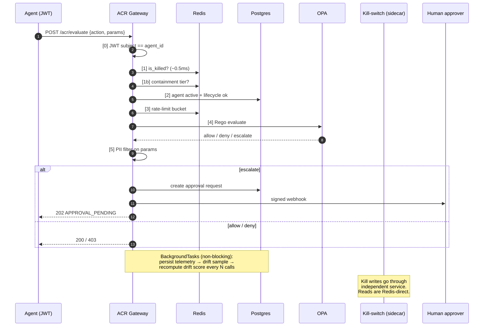

<div align="center">


# **ACR Framework**
### Autonomous Control & Resilience for Runtime AI Governance

**The control plane your autonomous AI agents need before you let them touch production.**

[](LICENSE)
[](https://github.com/AdamDiStefanoAI/acr-framework/releases)
[]()
[]()

[](docs/compliance/acr-nist-ai-rmf-mapping.md)
[](docs/compliance)
[](docs/compliance)
[]()
[]()
[]()
[]()
[]()

**[📖 Docs](./docs)** · **[🚀 Quickstart](#-quickstart-60-seconds)** · **[🏛️ For Executives](#-for-security--risk-executives)** · **[⚙️ For Engineers](#%EF%B8%8F-for-engineers)** · **[🛡️ Threat Model](docs/security/acr-strike-threat-model.md)** · **[📋 Adopt ACR](./ADOPTION.md)**

---

</div>

## 🎯 Pick Your Path

| You are a... | Start here |
|---|---|
| 🏛️ **CISO, CRO, GRC lead, board member** — *I need to understand the risk and the answer* | **[For Security & Risk Executives ↓](#-for-security--risk-executives)** |
| ⚙️ **Engineer, SRE, security architect** — *I need to read the code and run the thing* | **[For Engineers ↓](#%EF%B8%8F-for-engineers)** |

---

# 🏛️ For Security & Risk Executives

## The problem in one sentence

> **You are about to give software the authority to act on behalf of your business, and your existing AI governance program stops at the moment that software goes into production.**

Traditional AI governance — model cards, pre-deployment reviews, NIST AI RMF documentation, ISO 42001 paperwork — happens **before** an AI system runs. It produces binders, not brakes. The moment an autonomous agent starts accessing customer data, calling APIs, issuing refunds, or filing tickets on your behalf, your design-time controls have nothing to enforce against.

That gap is where the risk lives: a perfectly compliant agent on day one can drift, be manipulated, or simply behave unexpectedly on day ninety — and there is nothing in your stack to notice, throttle, or stop it.

## What ACR is, in plain terms

**ACR is the seatbelt, airbag, ABS and crumple zone for autonomous AI.** It is a runtime control plane that sits between your AI agents and the systems they touch, and it enforces your governance policies on every single action the agent attempts — before that action ever leaves the building.

It does not replace your AI governance program. It is the part of the program that **executes**.

## What ACR gives you

| Outcome | What it means in practice |
|---|---|
| 🛑 **A real "off switch."** | A single command, kept on a separate system from the agent itself, instantly disables an agent globally. Even a compromised control plane cannot silently re-enable it. |
| 🚦 **Graduated containment, not just on/off.** | If an agent starts behaving abnormally, the system automatically throttles it, then restricts its tools, then escalates everything to a human, and only kills it as a last resort. Four tiers, no operator paged at 3am for the small stuff. |
| 👁️ **A complete, signed audit trail of every decision.** | Every action an agent attempted, every policy that fired, every approval, every override — all hashed and exportable as a tamper-evident evidence bundle for auditors and incident response. |
| 🧑‍⚖️ **Human-in-the-loop, where it matters.** | High-risk actions (refunds above a threshold, schema changes, cross-tenant access) automatically pause and route to a named human approver with an SLA. If the human doesn't respond in time, the action auto-denies. |
| 📉 **Drift detection on agent *behavior*, not just model accuracy.** | The system continuously baselines what "normal" looks like for each agent and raises a score when an agent starts using new tools, denying more often, or behaving more erratically than its baseline allows. |
| 📜 **Compliance you can actually evidence.** | Pre-built mappings to NIST AI RMF, ISO/IEC 42001, and SOC 2, with the audit artifacts to back them up. Auditors get a download, not a meeting. |

## The six pillars (the executive version)

ACR enforces six categories of control on every agent action:

| # | Pillar | What it answers |
|---|---|---|
| 1️⃣ | **Identity & Purpose Binding** | *"Is this really our agent, and is it doing what we hired it to do?"* |
| 2️⃣ | **Behavioral Policy Enforcement** | *"Is this specific action allowed by our policy, right now?"* |
| 3️⃣ | **Autonomy Drift Detection** | *"Is this agent behaving the way it did last week?"* |
| 4️⃣ | **Execution Observability** | *"Can we prove what happened, to whom, when, and why?"* |
| 5️⃣ | **Self-Healing Containment** | *"If it starts misbehaving, does it stop itself before we have to?"* |
| 6️⃣ | **Human Authority** | *"When the stakes are high, does a human still get the final say?"* |

## Why this matters now

Three forces are converging:

1. **Regulators are catching up.** The EU AI Act, NIST AI RMF, and emerging US state laws all expect *operational* AI controls, not just paperwork.
2. **Insurers are pricing AI risk.** Carriers are starting to ask whether you have runtime governance — not whether you have a model card.
3. **The agents are getting more autonomous.** Tool use, multi-step planning, and agent-to-agent delegation mean the blast radius of a single bad decision is growing fast.

Doing nothing is itself a decision. ACR gives you a defensible, standards-aligned, open-source answer.

## How to evaluate ACR in 30 minutes

1. **Read this section.** ✅ You are most of the way there.
2. **Skim the [Six Pillars overview](docs)** — one paragraph per pillar.
3. **Look at the [NIST AI RMF mapping](docs/compliance/acr-nist-ai-rmf-mapping.md)** to see how it lines up with the framework you are already being measured against.
4. **Hand the engineering section below to your security architect.** They will be able to tell you in an afternoon whether this fits your stack.

> 💡 **Bottom line for the board:** ACR is the difference between *"we have an AI policy"* and *"we can prove our AI followed the policy on every one of last quarter's 14 million decisions, and we stopped it the three times it tried not to."*

---

# ⚙️ For Engineers

## TL;DR

**ACR is a policy-enforcing gateway for AI agents.** Every action an agent wants to take goes through `POST /acr/evaluate` and gets a `allow | deny | escalate` decision in **<200ms**. It's a single FastAPI service backed by Postgres + Redis + OPA, with a separate kill-switch sidecar, deployable on Kubernetes or `docker compose up`.

## 🚀 Quickstart (60 seconds)

```bash
git clone https://github.com/AdamDiStefanoAI/acr-framework.git
cd acr-framework/implementations/acr-control-plane
cp .env.example .env
docker compose up --build
```

Migrations run automatically on startup (one-shot `acr-migrate` service). When the gateway is healthy:

```bash
curl http://localhost:8000/acr/health
# → {"status":"healthy","version":"1.0","env":"development"}

# Open the operator console
open http://localhost:8000/console
#   Operator API key:    dev-operator-key
#   Kill-switch secret:  killswitch_dev_secret_change_me
```

That's it. You now have a working six-pillar control plane on your laptop.

## The hot path



**Latency budget:** ~5ms identity, ~10ms rate limit, ~20–50ms OPA, <5ms PII filter. Total p95 target: **<200ms**, telemetry/drift never blocks the response.

## Architecture at a glance

```
                ┌─────────────────────────────────────────────────────────┐
                │                  ACR Control Plane                      │
                │                                                         │
   Agent ──JWT──▶│  FastAPI gateway  ──▶  OPA (Rego policies)             │
                │        │                                                │
                │        ├──▶ Postgres (agents, telemetry, approvals,     │
                │        │              drift baselines, policy releases) │
                │        │                                                │
                │        ├──▶ Redis (kill switch, rate limits, drift cache)│
                │        │                                                │
                │        └──▶ Background tasks (telemetry, drift, sweeps) │
                │                                                         │
                └─────────────────────────────────────────────────────────┘
                           │                              │
                           ▼                              ▼
                ┌──────────────────┐          ┌──────────────────────┐
                │ Kill-switch SVC  │          │   Human approvers    │
                │ (independent,    │          │ (HMAC-signed webhook │
                │  separate auth)  │          │  + operator console) │
                └──────────────────┘          └──────────────────────┘
```

## The six pillars (the engineering version)

| # | Pillar | Module | Backed by |
|---|---|---|---|
| 1 | **Identity & Purpose Binding** | `pillar1_identity/` | JWT (HS256/RS256/ES256, alg-pinned), Postgres `agents` table, lifecycle state machine (`draft → active → deprecated → retired`), lineage chain, capability tags, heartbeat sweep loop |
| 2 | **Behavioral Policy Enforcement** | `pillar2_policy/` | OPA via pooled `httpx.AsyncClient`, exponential-backoff retry, `aiobreaker` circuit breaker (5 fails / 60s → fail-secure deny). Policies authored in Rego with a draft → release → activate Studio lifecycle. |
| 3 | **Autonomy Drift Detection** | `pillar3_drift/` | Four signals — denial rate (0.35), call frequency (0.25), error rate (0.20), action diversity / Shannon entropy (0.20). Two-tier baselines: live ungoverned + versioned governed (`candidate → approved → active`) with dual-approval. |
| 4 | **Execution Observability** | `pillar4_observability/` | Structured `ACRTelemetryEvent` per request, correlation-ID indexed, OTLP + Prometheus exporters, SHA256-signed evidence bundles via `/acr/evidence/{correlation_id}`. |
| 5 | **Self-Healing Containment** | `pillar5_containment/` | Four graduated tiers — Throttle (0.60) → Restrict (0.75) → Isolate (0.90) → Kill (0.95). Kill writes go through an **independent sidecar** with its own `KILLSWITCH_SECRET` so a compromised gateway cannot silently re-enable agents. |
| 6 | **Human Authority** | `pillar6_authority/` | Persisted approval requests with configurable SLA (default 240m), background expiry loop, HMAC-SHA256-signed webhooks with idempotency keys, break-glass override (security_admin only, mandatory reason, WARN-logged). |

## Stack & ops posture

- **Language:** Python 3.11+, FastAPI, async SQLAlchemy 2 + asyncpg, Pydantic v2
- **Stores:** PostgreSQL (monthly partitioned `telemetry_events` and `drift_metrics`, 90-day retention sweep), Redis 7
- **Policy engine:** Open Policy Agent (Rego), with a draft/release/activate Policy Studio
- **Auth:** JWT for agents (alg allowlist), API keys *and* OIDC for operators, four RBAC roles (`agent_admin`, `security_admin`, `approver`, `auditor`)
- **Observability:** structlog JSON logs, OpenTelemetry OTLP traces + metrics, `/acr/metrics` Prometheus endpoint, SHA256-signed evidence bundles
- **Deployment:** `docker compose` for local, Kustomize for Kubernetes (HPAs, PDBs, NetworkPolicies, RBAC, init container that runs `alembic upgrade head` automatically)
- **CI:** GitHub Actions with lint, test, `pip-audit` security scanning

## Design choices that matter

- **Fail-secure everywhere.** OPA down → deny. Redis down → deny. Unexpected exception → deny. Never silently allow.
- **The kill switch is a separate process.** Reads are Redis-direct for the hot path; writes go through an independent service with its own secret. A compromised gateway cannot un-kill an agent.
- **Hot path is non-blocking.** Telemetry persistence, drift sampling, and drift score recomputation are all `BackgroundTasks`. The 200ms latency budget covers only the decision, not the bookkeeping.
- **Policy is code, not config.** All allow/deny/escalate logic is Rego, versioned and shipped through the Policy Studio's release lifecycle. No `if statement in Python` policy decisions.
- **Drift baselines have governance.** Without it, a slowly-misbehaving agent could simply re-baseline itself into "normal." Governed baselines require proposal → approval → activation by separate operators.
- **Migrations are automatic.** Both K8s and `docker compose` run `alembic upgrade head` before the gateway starts. You cannot forget to migrate.
- **Weak secrets are rejected at startup.** Production environments refuse to boot with default JWT keys, weak kill-switch secrets, or missing executor HMAC keys.

## The agent registry (Pillar 1, expanded)

The registry is more than a key-value store — it carries the metadata other pillars need to make smart decisions:

| Field | Why it exists |
|---|---|
| `agent_id`, `owner`, `purpose`, `risk_tier` | Identity and accountability |
| `version` | Audit trail of which version of an agent did what |
| `parent_agent_id` | Lineage for orchestrator → subagent relationships (non-FK so retirement preserves history) |
| `capabilities[]` | Declared skills, distinct from the tool allowlist — used by `/acr/agents/discover` |
| `lifecycle_state` | `draft → active → deprecated → retired` state machine, gates the evaluate hot path |
| `health_status` + `last_heartbeat_at` | Stale agents auto-downgrade to `unhealthy` via the sweep loop |
| `allowed_tools[]` / `forbidden_tools[]` | Authoritative tool boundaries enforced by Rego |
| `boundaries` | Rate, spend, region, and credential rotation limits |

## API surface (selected)

```
POST   /acr/evaluate                          # the hot path
POST   /acr/agents                            # register
GET    /acr/agents/discover?capability=...    # discovery
POST   /acr/agents/{id}/lifecycle             # state transitions
POST   /acr/agents/{id}/heartbeat             # health
GET    /acr/agents/{id}/lineage               # ancestor chain + children
POST   /acr/agents/{id}/token                 # issue short-lived JWT

GET    /acr/drift/{id}                        # current drift score
POST   /acr/drift/{id}/baseline/propose       # governed baseline workflow
POST   /acr/drift/{id}/baseline/{ver}/approve
POST   /acr/drift/{id}/baseline/{ver}/activate

GET    /acr/events/{correlation_id}           # decision chain replay
GET    /acr/evidence/{correlation_id}         # signed evidence bundle (SHA256)

POST   /acr/approvals/{id}/approve            # human authority
POST   /acr/approvals/{id}/override           # break-glass (WARN-logged)

GET    /acr/health  /acr/live  /acr/ready     # k8s probes
GET    /acr/metrics                           # Prometheus text
```

Full OpenAPI is served at `/docs` and `/redoc` (operator-authenticated outside development).

## Repo layout

```
acr-framework/
├── docs/                            ← framework spec (the "why")
├── implementations/
│   └── acr-control-plane/           ← runnable reference implementation
│       ├── src/acr/
│       │   ├── pillar1_identity/    ← registry, lifecycle, lineage, JWT
│       │   ├── pillar2_policy/      ← OPA client, circuit breaker, output filter
│       │   ├── pillar3_drift/       ← signals, baselines, governance
│       │   ├── pillar4_observability/ ← telemetry, OTLP, evidence bundles
│       │   ├── pillar5_containment/ ← graduated tiers, kill switch
│       │   ├── pillar6_authority/   ← approvals, webhooks, override
│       │   ├── policy_studio/       ← draft → release → activate lifecycle
│       │   ├── gateway/             ← FastAPI router, middleware, executor
│       │   ├── operator_console/    ← read-only web UI
│       │   └── db/migrations/       ← Alembic (head: 0012)
│       ├── policies/                ← Rego policies + tests
│       ├── deploy/k8s/base/         ← Kustomize manifests
│       ├── tests/                   ← 160+ unit + integration tests
│       ├── docker-compose.yml
│       └── Dockerfile{,.killswitch}
└── README.md                         ← you are here
```

## Where to look first if you're reading the code

1. **`src/acr/main.py`** — application wiring, lifespan, background loops
2. **`src/acr/gateway/router.py`** — the `/acr/evaluate` hot path
3. **`src/acr/pillar2_policy/engine.py`** — the OPA client with retry + circuit breaker
4. **`src/acr/pillar5_containment/graduated.py`** — the four-tier containment ladder
5. **`policies/`** — the Rego policies that actually make the allow/deny calls

## Compliance mappings

| Standard | Mapping |
|---|---|
| 🇺🇸 NIST AI RMF | [`docs/compliance/acr-nist-ai-rmf-mapping.md`](docs/compliance/acr-nist-ai-rmf-mapping.md) |
| 🌍 ISO/IEC 42001 | [`docs/compliance/`](docs/compliance) |
| 🔒 SOC 2 | [`docs/compliance/`](docs/compliance) |
| 🛡️ Threat model | [`docs/security/acr-strike-threat-model.md`](docs/security/acr-strike-threat-model.md) |

## Project status

- ✅ Six pillars implemented and tested
- ✅ Production-grade Kubernetes manifests
- ✅ Automated migrations (no manual `alembic upgrade head`)
- ✅ Compliance mappings for NIST AI RMF, ISO 42001, SOC 2
- ✅ 160+ unit tests, evidence-bundle integration tests
- 📋 [Roadmap](./ROADMAP.md) · [Changelog](./CHANGELOG.md) · [Adoption guide](./ADOPTION.md)

## Contributing

We welcome PRs, issues, and threat-model discussions. See [`CONTRIBUTING.md`](./CONTRIBUTING.md), [`GOVERNANCE.md`](./GOVERNANCE.md), and [`CODE_OF_CONDUCT.md`](./CODE_OF_CONDUCT.md). Security issues: [`SECURITY.md`](./SECURITY.md).

---

<div align="center">

## **Like OWASP for AppSec. Like MITRE ATT&CK for threats.**
## **ACR is the reference architecture for runtime AI governance.**

[](LICENSE)
[](./ADOPTION.md)
[](https://github.com/AdamDiStefanoAI/acr-framework)

**[autonomouscontrol.io/control-plane](https://autonomouscontrol.io/control-plane)**

</div>
