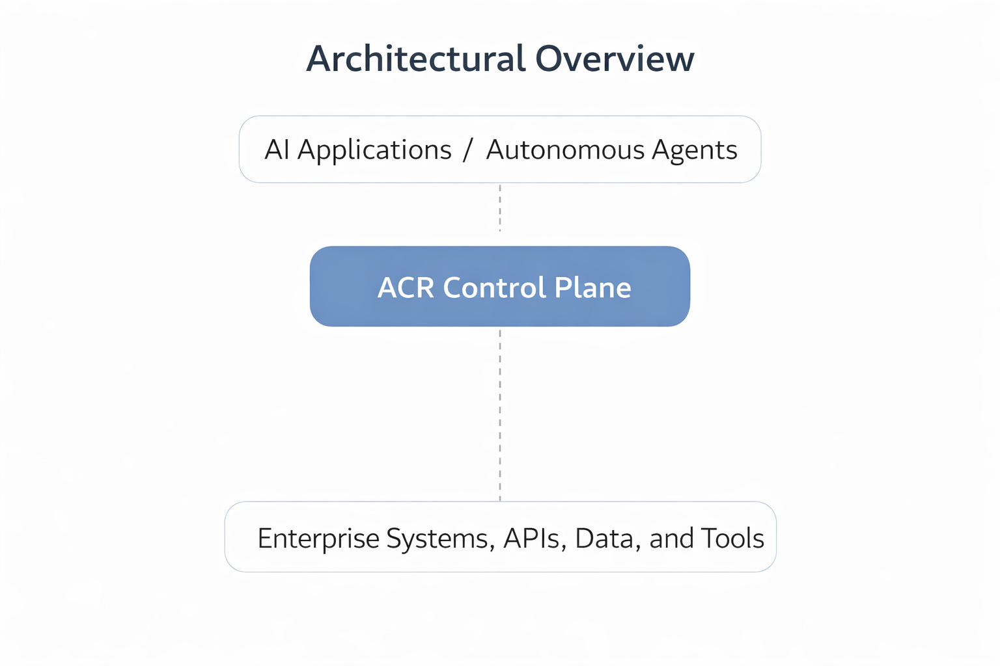

# ACR Control Plane Architecture

The ACR Framework introduces a runtime control plane responsible for governing autonomous AI systems operating within enterprise environments.

While traditional AI governance focuses on policies, model documentation, and risk management processes, the ACR Framework provides the **technical architecture required to enforce those policies during system execution**.

The ACR Control Plane mediates interactions between autonomous AI systems and enterprise infrastructure, ensuring governance policies remain enforceable while systems operate in production.

---

# Architectural Overview

The ACR Control Plane operates as an intermediary layer between autonomous AI systems and enterprise resources.

This layer ensures that all AI actions are subject to governance controls before interacting with enterprise infrastructure.

 
By positioning governance controls in this location, organizations can maintain visibility, enforce policies, and intervene in AI system behavior during runtime.

---

# Core Control Plane Components

## Identity & Purpose Registry

The Identity & Purpose Registry maintains authoritative records describing the operational identity of each AI system.

This registry defines:

- system identity
- operational role
- authorized capabilities
- approved data sources
- permitted tool usage

Every AI system operating under ACR governance must be registered with a defined operational purpose.

This prevents AI systems from expanding their behavior beyond their approved scope.

---

## Governance Policy Engine

The Governance Policy Engine enforces the behavioral constraints defined by organizational AI governance policies.

The engine evaluates system actions against rules such as:

- allowed data access
- permitted system interactions
- approved workflow boundaries
- output restrictions
- escalation requirements

Every action performed by an AI system must pass through policy validation before execution.

---

## Tool Access Gateway

Autonomous AI systems frequently interact with enterprise tools, APIs, and services.

The Tool Access Gateway mediates these interactions to ensure that AI systems only access approved resources.

Capabilities include:

- validating tool permissions
- restricting sensitive system actions
- enforcing authorization controls
- logging tool activity

This gateway prevents unauthorized actions such as data exfiltration, unintended automation, or privileged system interactions.

---

## Observability Pipeline

The Observability Pipeline captures runtime telemetry describing AI system activity.

This pipeline records information such as:

- system inputs
- reasoning traces
- system outputs
- tool interactions
- workflow execution steps

Execution observability enables monitoring, auditing, and forensic investigation of AI system behavior.

---

## Autonomy Drift Detection Engine

As AI systems interact with dynamic inputs and evolving workflows, their behavior may gradually diverge from intended operational boundaries.

The Drift Detection Engine monitors system activity to identify patterns such as:

- expanded operational scope
- abnormal system actions
- unexpected tool usage
- anomalous execution sequences

Drift detection provides early warning signals that governance boundaries may be eroding.

---

## Containment & Response Controls

If abnormal or unsafe system behavior is detected, the ACR Control Plane enables automated containment responses.

Examples include:

- restricting system capabilities
- interrupting AI workflows
- isolating AI processes
- escalating events to human operators

These mechanisms allow organizations to limit risk from adversarial manipulation, system malfunction, or unexpected system behavior.

---

## Human Oversight Interface

Autonomous AI systems must remain subject to human authority.

The Human Oversight Interface allows operators to:

- monitor AI system activity
- review system decisions
- intervene in system operations
- override automated actions
- suspend or terminate AI execution

Human authority remains the final governance layer within the ACR architecture.

---

# Runtime Governance Flow

The ACR Control Plane governs AI system activity through a continuous operational cycle.

1. AI system receives a task, prompt, or input.
2. The Identity Registry validates the system identity and purpose.
3. The Policy Engine evaluates whether the requested action is allowed.
4. The Tool Gateway mediates interactions with enterprise systems.
5. Execution telemetry is captured by the Observability Pipeline.
6. Drift Detection monitors behavior for anomalies.
7. If abnormal activity is detected, containment controls may activate.
8. Human oversight remains available for intervention and review.

This cycle ensures governance policies remain active throughout AI system operation.

---

# Architectural Benefits

Implementing the ACR Control Plane provides several governance advantages:

• runtime enforcement of AI governance policies  
• visibility into AI decision processes  
• containment mechanisms for abnormal behavior  
• reduced risk from adversarial manipulation  
• preservation of human oversight over automated systems  

Together, these capabilities enable organizations to safely deploy increasingly autonomous AI systems.

---

# Relationship to the ACR Framework

The Control Plane Architecture operationalizes the six governance layers defined by the ACR Framework:

| ACR Control Layer | Control Plane Component |
|---|---|
| Identity & Purpose Binding | Identity & Purpose Registry |
| Behavioral Policy Enforcement | Governance Policy Engine |
| Autonomy Drift Detection | Drift Detection Engine |
| Execution Observability | Observability Pipeline |
| Self-Healing & Containment | Containment Controls |
| Human Authority | Oversight Interface |

These components translate governance principles into enforceable technical mechanisms.

---

# Summary

The ACR Control Plane Architecture provides the operational foundation required to govern autonomous AI systems in production environments.

By introducing a runtime governance layer between AI systems and enterprise infrastructure, organizations can enforce governance policies, monitor system behavior, detect anomalies, and intervene when necessary.

This architecture ensures that autonomous AI systems remain aligned with organizational policy, operational constraints, and human oversight.
